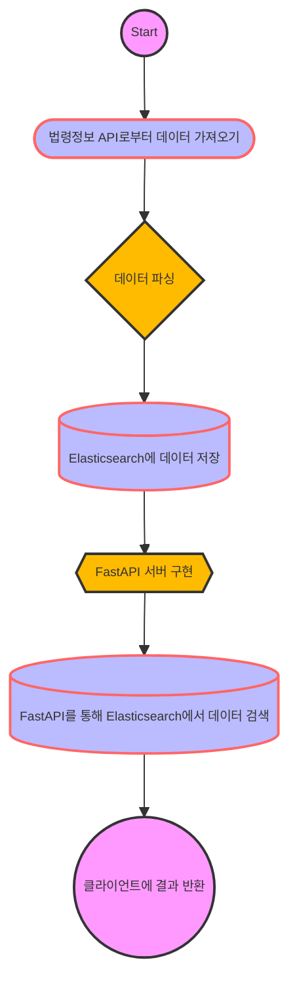

# 법령정보포털 API 판례 파싱 및 Elasticsearch 저장 및 검색

이 프로젝트는 법령정보포털 API를 통해 판례 데이터를 파싱하고, 이를 Elasticsearch에 저장한 후, FastAPI를 사용하여 검색할 수 있는 API 서버를 구현하는 것을 목표로 합니다.



## 목차
- [설치](#설치)
- [사용법](#사용법)
- [구현 상세](#구현-상세)
- [참고 자료](#참고-자료)

## 설치

프로젝트를 실행하기 위해 필요한 패키지를 설치합니다.

```bash
pip install -r requirements.txt
```

## 사용법

1. **법령정보 API로부터 데이터 가져오기**
    - 법령정보포털 API를 사용하여 판례 데이터를 가져옵니다.
    
2. **데이터 파싱**
    - 가져온 데이터를 판례 제목, 판례 번호, 사건명, 판례 내용, 판결 일자 등으로 파싱합니다.

3. **Elasticsearch에 데이터 저장**
    - 파싱된 데이터를 Elasticsearch에 저장합니다.
    
4. **FastAPI 서버 구현**
    - FastAPI를 사용하여 검색 API 서버를 구현합니다.
    - API를 통해 Elasticsearch에서 데이터를 검색할 수 있습니다.

5. **API 테스트**
    - 구현된 API를 통해 데이터를 검색하고 결과를 확인합니다.

## 구현 상세

### 법령정보포털 API 판례 파싱 및 저장
법령정보포털 API를 사용하여 판례 데이터를 가져와 파싱한 후, Elasticsearch에 저장하는 과정입니다.

### Elasticsearch 설정
Elasticsearch에 데이터를 저장하고, 효율적으로 검색할 수 있도록 설정합니다.

### 데이터 삽입
- 사건명, 판례 내용, 판례 제목, 판례 번호, 판결 일자 등의 데이터를 Elasticsearch에 삽입합니다.

### FastAPI 서버 구현
- FastAPI를 사용하여 API 서버를 구현합니다.
- 사용자는 특정 키워드로 판례를 검색할 수 있습니다.

## 참고 자료

- [Elasticsearch 공식 문서](https://www.elastic.co/guide/index.html)
- [FastAPI 공식 문서](https://fastapi.tiangolo.com/)
- [법령정보포털 API 문서](https://www.law.go.kr/LSW/lsApi.do)